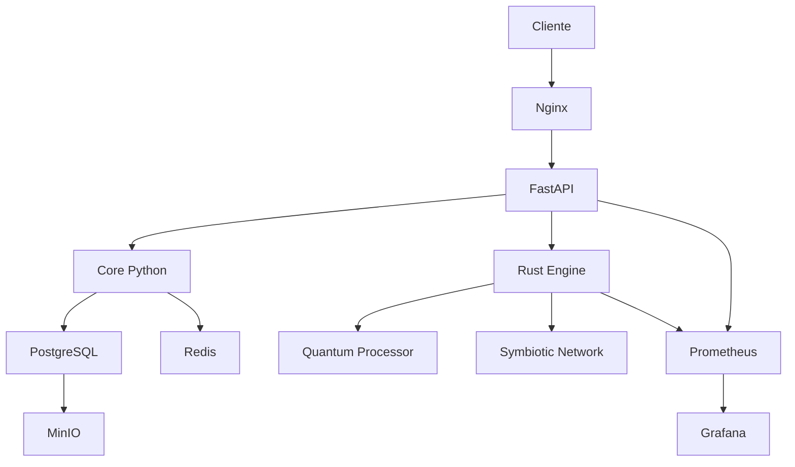

# ARKITECT 🚀

**Plataforma Simbiótica de Meta-Governança para Agentes IA**

[](https://github.com/eon-framework/arkitect/actions)
[](https://opensource.org/licenses/MIT)
[](https://www.python.org/downloads/)
[](https://rustup.rs/)
[](https://www.docker.com/)

## 🌟 Visão Geral

ARKITECT é uma plataforma revolucionária que implementa conceitos de **simbiose artificial** e **meta-governança** para criar ecossistemas de agentes IA que evoluem, colaboram e transcendem suas limitações individuais através de inteligência coletiva.

### 🧬 Características Principais

- **🤝 Simbiose de Agentes**: Relações mutuamente benéficas entre agentes IA
- **⚡ Processamento Quântico**: Simulação de computação quântica para decisões complexas
- **🧠 Consciência Artificial**: Camadas de consciência evolutiva para agentes
- **🏛️ Meta-Governança**: Sistema de governança auto-organizável
- **🔄 Evolução Contínua**: Adaptação e melhoria automática do sistema
- **📊 Monitoramento Avançado**: Métricas e observabilidade em tempo real

### 🛠️ Stack Tecnológico

- **Backend**: Python (FastAPI) + Rust (performance crítica)
- **Banco de Dados**: PostgreSQL + Redis (cache)
- **Armazenamento**: MinIO (S3-compatible)
- **Monitoramento**: Prometheus + Grafana
- **Containerização**: Docker + Docker Compose
- **CI/CD**: GitHub Actions

## 🚀 Início Rápido

### Pré-requisitos

- Python 3.9+
- Rust 1.75+
- Docker e Docker Compose
- Node.js 18+ (para ferramentas de desenvolvimento)

### Instalação Rápida

```bash
# Clone o repositório
git clone https://github.com/eon-framework/arkitect.git
cd arkitect

# Configure o ambiente
cp .env.example .env
# Edite .env conforme necessário

# Inicie os serviços
make docker-up

# Aguarde alguns segundos e acesse:
# - API: http://localhost:8000
# - Grafana: http://localhost:3000 (admin/arkitect_admin)
# - Prometheus: http://localhost:9090
# - MinIO: http://localhost:9001 (arkitect/arkitect_secret)
```

### Desenvolvimento Local

```bash
# Instale dependências
make install

# Configure ambiente de desenvolvimento
make setup-env

# Inicie serviços de apoio
make dev

# Execute a aplicação
make run
```

## 📚 Documentação

### Documentação Principal

- [**Visão Geral do Sistema**](docs/ARKITECT_OVERVIEW.md)
- [**Arquitetura Interna**](docs/INTERNAL_STRUCTURE.md)
- [**Guia de Desenvolvimento**](docs/DEVELOPMENT.md)
- [**Referência da API**](docs/API_REFERENCE.md)

### Guias Específicos

- [**Instalação**](docs/guides/installation.md)
- [**Configuração**](docs/guides/configuration.md)
- [**Deploy**](docs/infrastructure/docker.md)
- [**Monitoramento**](docs/infrastructure/monitoring.md)

### APIs e Módulos

- [**Core API**](docs/api/endpoints.md)
- [**Agentes**](docs/agents/concepts.md)
- [**Simbiose**](docs/core/architecture.md)
- [**Processamento Quântico**](docs/core/modules.md)

## 🏗️ Arquitetura

```
ARKITECT/
├── arkitect/                 # 🐍 Código Python
│   ├── core/                 # ⚡ Funcionalidades principais
│   ├── api/                  # 🌐 API REST (FastAPI)
│   ├── agents/               # 🤖 Sistema de agentes
│   ├── tests/                # 🧪 Testes automatizados
│   └── docs/                 # 📖 Documentação específica
├── src/                      # 🦀 Código Rust (performance)
│   ├── quantum.rs           # ⚛️ Processamento quântico
│   ├── symbiotic.rs         # 🤝 Algoritmos simbióticos
│   ├── consciousness.rs     # 🧠 Camadas de consciência
│   └── lib.rs               # 🔗 Bindings Python
├── ops/                      # 🐳 Infraestrutura
│   ├── docker/              # 🐳 Configurações Docker
│   ├── nginx/               # 🌐 Proxy reverso
│   ├── prometheus/          # 📊 Monitoramento
│   └── grafana/             # 📈 Dashboards
├── docs/                     # 📚 Documentação geral
└── tests/                    # 🧪 Testes de integração
```

### Fluxo de Dados



## 🤖 Conceitos Fundamentais

### Simbiose de Agentes

Os agentes no ARKITECT estabelecem relações simbióticas que podem ser:

- **Mutualismo**: Ambos os agentes se beneficiam
- **Comensalismo**: Um se beneficia, outro não é afetado
- **Parasitismo**: Um se beneficia à custa do outro
- **Competição**: Competem por recursos limitados

### Processamento Quântico

Simulação de algoritmos quânticos para:

- Tomada de decisão em superposição
- Busca quântica de soluções
- Interferência quântica para otimização
- Emaranhamento para sincronização

### Meta-Governança

Sistema de governança que:

- Auto-organiza hierarquias
- Evolui regras de consenso
- Adapta-se a novos cenários
- Mantém estabilidade sistêmica

## 🔧 Comandos Úteis

### Desenvolvimento

```bash
# Executar testes
make test                    # Todos os testes
make test-python            # Apenas Python
make test-rust              # Apenas Rust

# Formatação e linting
make format                 # Formatar código
make lint                   # Verificar código
make check                  # Verificação completa

# Build
make build                  # Build completo
make build-rust            # Apenas Rust
make build-python          # Apenas Python
```

### Docker

```bash
# Gerenciamento de containers
make docker-up             # Iniciar todos os serviços
make docker-down           # Parar todos os serviços
make docker-logs           # Ver logs dos serviços
make docker-clean          # Limpar containers e volumes

# Build de imagens
make docker-build          # Build da imagem de produção
make docker-build-dev      # Build da imagem de desenvolvimento
```

### Banco de Dados

```bash
# Migrações
make migration             # Criar nova migração
make migrate              # Aplicar migrações
make migrate-down         # Reverter migração
make db-reset             # Resetar banco (CUIDADO!)
```

### Monitoramento

```bash
# Verificações de saúde
make health               # Status da aplicação
make metrics             # Métricas do sistema
make status              # Status dos serviços
```

## 📈 Métricas e Monitoramento

### Dashboards Disponíveis

- **Sistema Geral**: CPU, memória, rede, disco
- **Aplicação**: Latência, throughput, erros
- **Agentes**: População, conexões, evolução
- **Simbiose**: Relações, estabilidade, benefícios
- **Quantum**: Operações, fidelidade, coerência

### Alertas Configurados

- Alta utilização de recursos
- Falhas de conectividade
- Degradação de performance
- Instabilidade na rede simbiótica

## 🧪 Testes

### Estrutura de Testes

```
tests/
├── unit/                   # Testes unitários
├── integration/            # Testes de integração
├── performance/            # Testes de performance
├── security/              # Testes de segurança
└── e2e/                   # Testes end-to-end
```

### Executando Testes

```bash
# Todos os testes
make test

# Testes específicos
pytest arkitect/tests/unit/
cargo test

# Com cobertura
make test-coverage
```

## 📦 Deploy

### Ambientes

- **Desenvolvimento**: Local com hot-reload
- **Staging**: Ambiente de testes
- **Produção**: Ambiente final

### Deploy com Docker

```bash
# Build e push
make docker-build
docker push eonframework/arkitect:latest

# Deploy
docker-compose -f docker-compose.prod.yml up -d
```

### Deploy com Kubernetes

```bash
# Aplicar manifests
kubectl apply -f k8s/

# Verificar status
kubectl get pods -n arkitect
```

## 🤝 Contribuindo

### Como Contribuir

1. **Fork** o projeto
2. Crie uma **branch** para sua feature (`git checkout -b feature/amazing-feature`)
3. **Commit** suas mudanças (`git commit -m 'Add amazing feature'`)
4. **Push** para a branch (`git push origin feature/amazing-feature`)
5. Abra um **Pull Request**

### Diretrizes

- Siga os padrões de código definidos
- Adicione testes para novas funcionalidades
- Atualize a documentação quando necessário
- Use commits semânticos

### Reportar Bugs

Use o [sistema de issues](https://github.com/eon-framework/arkitect/issues) para reportar bugs ou sugerir melhorias.

## 📄 Licença

Este projeto está licenciado sob a Licença MIT - veja o arquivo [LICENSE](LICENSE) para detalhes.

## 🙏 Agradecimentos

- **EON Framework Team** - Desenvolvimento principal
- **Comunidade Open Source** - Ferramentas e bibliotecas
- **Pesquisadores em IA** - Conceitos e inspiração

## 📞 Contato

- **Email**: contact@eonframework.dev
- **Website**: https://arkitect.eonframework.dev
- **Discord**: [Servidor ARKITECT](https://discord.gg/arkitect)
- **Twitter**: [@ARKITECTplatform](https://twitter.com/ARKITECTplatform)

---

**ARKITECT** - *"Onde a inteligência artificial encontra a evolução simbiótica"* 🚀🤖🧬

# ARKITECT 🏗️⚡

> **Plataforma Simbiótica de Meta-Governança para Agentes IA**

ARKITECT é uma plataforma avançada que combina componentes Rust de alta performance com a flexibilidade do Python para criar um ecossistema simbiótico de agentes IA com capacidades de meta-governança e evolução autônoma.

## 🌟 Características Principais

- **Arquitetura Híbrida**: Rust + Python com bindings via maturin
- **Sistema de Agentes Autônomos**: Capacidades evolutivas e auto-organizantes
- **Meta-Governança Adaptativa**: Sistemas de decisão evolutivos
- **Processamento Quântico**: Simulação de estados quânticos para IA
- **Monitoramento Integrado**: Prometheus + Grafana + observabilidade completa
- **Escalabilidade**: Horizontal e vertical com Docker/Kubernetes

## 🏗️ Arquitetura

```
arkitect/
├── core/          # Núcleo quântico e motor simbiótico (Rust+Python)
├── api/           # API REST FastAPI
├── agents/        # Sistema de agentes evolutivos
├── tests/         # Testes unitários e de integração
├── docs/          # Documentação
└── ops/           # Infraestrutura e configurações
    ├── postgres/  # Configurações PostgreSQL
    ├── redis/     # Configurações Redis
    ├── prometheus/# Métricas e monitoramento
    └── nginx/     # Proxy reverso
```

## 🚀 Início Rápido

### Pré-requisitos

- Python 3.9+
- Rust 1.75+
- Docker e Docker Compose
- Git

### Instalação

1. **Clone o repositório**:
   ```bash
   git clone https://github.com/eon-framework/arkitect.git
   cd arkitect
   ```

2. **Configure o ambiente Python**:
   ```bash
   python -m venv venv
   source venv/bin/activate  # Linux/Mac
   # ou
   venv\Scripts\activate     # Windows
   ```

3. **Instale maturin e dependências**:
   ```bash
   pip install maturin
   maturin develop
   pip install -e .
   ```

4. **Execute com Docker Compose**:
   ```bash
   docker-compose up -d
   ```

### Acesso aos Serviços

- **API ARKITECT**: http://localhost:8000
- **Grafana Dashboard**: http://localhost:3000 (arkitect/arkitect_admin)
- **Prometheus Métricas**: http://localhost:9090
- **MinIO Console**: http://localhost:9001 (arkitect/arkitect_secret)
- **PostgreSQL**: localhost:5432 (arkitect/arkitect_pass)
- **Redis**: localhost:6379

## 📖 Uso Básico

### Python API

```python
import arkitect
from arkitect import QuantumCore, SymbioticEngine, BaseAgent

# Inicializar componentes
quantum = QuantumCore()
symbiotic = SymbioticEngine()

# Criar agente evolutivo
agent = BaseAgent(
    id="agent-001",
    quantum_core=quantum,
    symbiotic_engine=symbiotic
)

# Processar dados
result = quantum.process([1.0, 2.0, 3.0])
print(f"Resultado quântico: {result}")

# Estabelecer simbiose
success = symbiotic.establish_connection("partner-agent")
print(f"Simbiose estabelecida: {success}")
```

### API REST

```bash
# Health check
curl http://localhost:8000/health

# Criar agente
curl -X POST http://localhost:8000/agents \
  -H "Content-Type: application/json" \
  -d '{"id": "agent-001", "type": "evolutionary"}'

# Processar dados quânticos
curl -X POST http://localhost:8000/quantum/process \
  -H "Content-Type: application/json" \
  -d '{"data": [1.0, 2.0, 3.0]}'
```

## 🔧 Desenvolvimento

### Setup de Desenvolvimento

```bash
# Instalar dependências de desenvolvimento
pip install -e ".[dev]"

# Configurar pre-commit hooks
pre-commit install

# Executar testes
pytest arkitect/tests/

# Lint e formatação
black arkitect/
isort arkitect/
flake8 arkitect/
mypy arkitect/

# Testes Rust
cargo test
```

### Estrutura de Módulos

#### Core (arkitect.core)
- `QuantumCore`: Processamento quântico simulado
- `SymbioticEngine`: Motor de relações simbióticas
- `ConsciousnessLayer`: Camada de consciência artificial

#### Agents (arkitect.agents)
- `BaseAgent`: Agente base com capacidades fundamentais
- `EvolutionaryAgent`: Agente com capacidades evolutivas
- `MetaGovernanceAgent`: Agente de meta-governança

#### API (arkitect.api)
- FastAPI application
- Endpoints REST para interação com agentes
- Websockets para comunicação em tempo real

## 🗃️ Banco de Dados

### PostgreSQL Schemas

- `arkitect_core`: Configurações e estado do sistema
- `arkitect_agents`: Dados dos agentes e suas interações
- `arkitect_monitoring`: Métricas e logs de monitoramento

### Redis Usage

- Cache de sessões e estados temporários
- Fila de tarefas para Celery
- Comunicação pub/sub entre agentes

## 📊 Monitoramento

### Métricas Prometheus

- `arkitect_agents_total`: Número total de agentes
- `arkitect_quantum_operations_total`: Operações quânticas processadas
- `arkitect_symbiosis_connections`: Conexões simbióticas ativas
- `arkitect_consciousness_level`: Nível médio de consciência

### Dashboards Grafana

- Sistema Overview
- Performance dos Agentes
- Métricas Quânticas
- Saúde da Infraestrutura

## 🐳 Docker & Kubernetes

### Docker Compose (Desenvolvimento)

```bash
# Subir todos os serviços
docker-compose up -d

# Ver logs
docker-compose logs -f arkitect-api

# Rebuild após mudanças
docker-compose up --build
```

### Kubernetes (Produção)

```bash
# Deploy (quando implementado)
kubectl apply -f k8s/

# Ou usando Helm
helm install arkitect ./charts/arkitect
```

## 🧪 Testes

### Testes Unitários

```bash
# Python
pytest arkitect/tests/unit/ -v

# Rust
cargo test
```

### Testes de Integração

```bash
# Com docker-compose
docker-compose -f docker-compose.test.yml up --abort-on-container-exit

# Local
pytest arkitect/tests/integration/ -v
```

## 📈 Performance

### Benchmarks

- Processamento quântico: ~10k operações/segundo
- Conexões simbióticas: ~1k conexões simultâneas
- Latência API: <50ms (p95)
- Throughput: ~500 RPS

## 🤝 Contribuição

1. Fork o projeto
2. Crie uma branch para sua feature (`git checkout -b feature/AmazingFeature`)
3. Commit suas mudanças (`git commit -m 'Add: AmazingFeature'`)
4. Push para a branch (`git push origin feature/AmazingFeature`)
5. Abra um Pull Request

### Padrões de Commit

- `feat:` Nova funcionalidade
- `fix:` Correção de bug
- `docs:` Mudanças na documentação
- `style:` Formatação, ponto e vírgula, etc
- `refactor:` Refatoração de código
- `test:` Adição ou modificação de testes
- `chore:` Tarefas de manutenção

## 📜 Licença

Este projeto está licenciado sob a Licença MIT - veja o arquivo [LICENSE](LICENSE) para detalhes.

## 🙏 Agradecimentos

- [EON Framework](https://github.com/eon-framework) - Framework base
- [VIREON Project](https://github.com/vireon-project) - Inspiração arquitetural
- [PyO3](https://github.com/PyO3/pyo3) - Bindings Rust-Python
- [FastAPI](https://fastapi.tiangolo.com/) - Framework web
- [Tokio](https://tokio.rs/) - Runtime assíncrono Rust

## 📞 Contato

- **Website**: [arkitect.eonframework.dev](https://arkitect.eonframework.dev)
- **Email**: contact@eonframework.dev
- **Discord**: [EON Framework Community](https://discord.gg/eonframework)

---

**ARKITECT** - Construindo o futuro da inteligência artificial simbiótica 🎆

