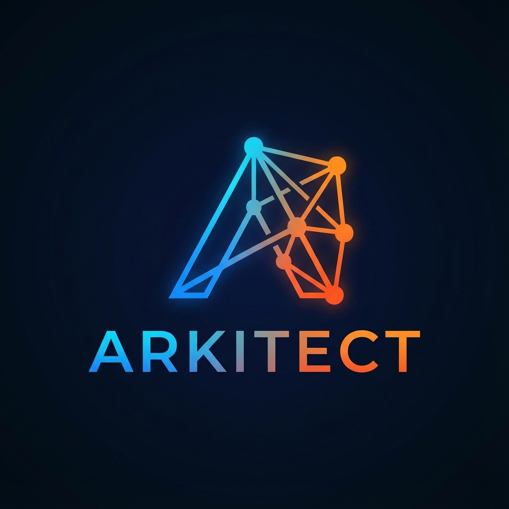

# ARKITECT 🚀

**High-Performance Agent Orchestration for Developers**

[](https://opensource.org/licenses/MIT)
[](https://www.python.org/downloads/)
[](https://rustup.rs/)
[](https://modelcontextprotocol.io)
[](https://github.com/psf/black)
[](CONTRIBUTING.md)
[](https://github.com/SH1W4/arkitect/commits/master)
[](https://github.com/SH1W4/arkitect/issues)

<p align="center">
  
</p>

## 🎯 What is Arkitect?

**Arkitect** is a production-grade orchestration platform designed to bridge the gap between high-performance computing and modern AI agent systems. Built with a hybrid **Rust/Python** architecture, it provides a robust foundation for building, managing, and scaling autonomous agent workflows.

Unlike traditional task queues, Arkitect is built from the ground up for **AI Agents**, featuring native **MCP (Model Context Protocol)** integration that allows LLMs to directly perceive and manipulate the runtime environment.

### 🌟 Key Capabilities

- **Intelligent Orchestration**: DAG-based scheduler with advanced algorithms (SJF, Round Robin, Deadline).
- **Native MCP Support**: Instantly compatible with Claude, Cursor, and other AI assistants.
- **Multi-Agent Coordination**: Manages collaboration, resource sharing, and trust between agents.
- **Enterprise Observability**: Prometheus metrics, health monitoring, and structured logging.

### Why Arkitect?

- **🔥 Performance-First**: Rust core for critical operations, Python for flexibility
- **🤖 AI Agent Ready**: Native MCP (Model Context Protocol) integration for seamless AI agent interaction
- **⚡ Task Orchestration**: Intelligent DAG-based task scheduling with multi-layer execution
- **📊 Observable**: Built-in metrics, monitoring, and real-time insights
- **🔧 Developer-Friendly**: Simple API, extensive documentation, easy integration

## 🚀 Quick Start

### Installation

```bash
# Clone the repository
git clone https://github.com/SH1W4/arkitect.git
cd arkitect

# Install dependencies
pip install -e .

# Start the orchestrator API
python -m arkitect.orchestrator.main
```

### Using the MCP Server

Arkitect includes a Model Context Protocol server that allows AI agents to interact with your task orchestrator:

```bash
# Start the MCP server
python -m arkitect.mcp.server
```

Now AI coding assistants can:
- Create and manage tasks
- Monitor system performance
- Query task status and results
- Orchestrate complex workflows

## 🏗️ Architecture

```
┌─────────────────────────────────────────────────────────┐
│                    AI Agents (MCP)                      │
└────────────────────┬────────────────────────────────────┘
                     │
┌────────────────────▼────────────────────────────────────┐
│              Arkitect Orchestrator (Python)             │
│  ┌──────────────┐  ┌──────────────┐  ┌──────────────┐  │
│  │ Task Manager │  │   Metrics    │  │  Monitoring  │  │
│  └──────────────┘  └──────────────┘  └──────────────┘  │
└────────────────────┬────────────────────────────────────┘
                     │
┌────────────────────▼────────────────────────────────────┐
│           Execution Layers (Rust Core)                  │
│  ┌──────────────┐  ┌──────────────┐  ┌──────────────┐  │
│  │    Local     │  │   Cluster    │  │ Quantum Sim  │  │
│  └──────────────┘  └──────────────┘  └──────────────┘  │
└─────────────────────────────────────────────────────────┘
```

## 🛠️ Core Features

### Task Orchestration
- **DAG-based Scheduling**: Define complex task dependencies
- **Multi-layer Execution**: Local, cluster, and simulated quantum processing
- **Priority Management**: Critical, high, medium, low priority levels
- **Automatic Retry**: Configurable retry logic for failed tasks

### MCP Integration
Connect any MCP-compatible AI agent to Arkitect:

```python
# AI agents can use these tools via MCP
- list_tasks(status, priority)      # Query tasks
- create_task(name, description)    # Create new tasks
- get_metrics()                      # System performance
- get_task_details(task_id)         # Task information
```

### Performance Monitoring
- Real-time metrics via Prometheus
- Grafana dashboards included
- WebSocket support for live updates
- Comprehensive logging

## 📚 Use Cases

### For Developers

**Automated Code Analysis**
```python
# Create a task to analyze code quality
task = create_task(
    name="Analyze Repository",
    description="Run linting and security checks",
    priority="high"
)
```

**CI/CD Integration**
- Orchestrate build pipelines
- Run parallel test suites
- Deploy to multiple environments

**Development Workflows**
- Automate repetitive tasks
- Coordinate microservices
- Manage data processing pipelines

### For AI Agents

AI coding assistants can leverage Arkitect to:
- Execute long-running operations
- Coordinate multiple tasks
- Monitor system health
- Manage complex workflows

## 🔧 Configuration

### Basic Setup

```bash
# Copy environment template
cp .env.example .env

# Edit configuration
nano .env
```

### Environment Variables

```env
# API Configuration
API_HOST=0.0.0.0
API_PORT=8000

# Redis (optional)
REDIS_URL=redis://localhost:6379

# Monitoring
ENABLE_METRICS=true
METRICS_PORT=9090
```

## 📖 Documentation

- [MCP Server Guide](README_MCP.md) - Using the Model Context Protocol server
- [Task Mesh Architecture](TASK_MESH_ARCHITECTURE.md) - Deep dive into the orchestration system
- [API Reference](docs/API_REFERENCE.md) - Complete API documentation
- [Development Guide](docs/DEVELOPMENT.md) - Contributing and development setup

## 🎯 Roadmap

- [x] Core task orchestration
- [x] MCP server integration
- [x] Multi-layer execution
- [ ] Kubernetes native support
- [ ] Plugin system
- [ ] Advanced ML-based task optimization
- [ ] Real quantum computing integration

## 🤝 Contributing

We welcome contributions! Please see our [Contributing Guide](CONTRIBUTING.md) for details.

```bash
# Fork the repository
# Create a feature branch
git checkout -b feature/amazing-feature

# Make your changes
# Commit with conventional commits
git commit -m 'feat: add amazing feature'

# Push and create a PR
git push origin feature/amazing-feature
```

## 📄 License

This project is licensed under the MIT License - see the [LICENSE](LICENSE) file for details.

## 🙏 Acknowledgments

- Built with [FastAPI](https://fastapi.tiangolo.com/)
- Powered by [Rust](https://www.rust-lang.org/)
- MCP integration via [Model Context Protocol](https://modelcontextprotocol.io)

## 📞 Support

- **Issues**: [GitHub Issues](https://github.com/SH1W4/arkitect/issues)
- **Discussions**: [GitHub Discussions](https://github.com/SH1W4/arkitect/discussions)

## 📊 Project Stats

- **Language**: Python (65%), Rust (30%), Other (5%)
- **Architecture**: Hybrid Rust/Python microservices
- **Code Quality**: Black formatted, type-hinted, documented
- **License**: MIT - free for commercial and personal use

## 👤 Author

**SH1W4**
- GitHub: [@SH1W4](https://github.com/SH1W4)
- Project: [Arkitect](https://github.com/SH1W4/arkitect)

---

**ARKITECT** - *High-Performance Agent Orchestration for Modern Development* 🚀
